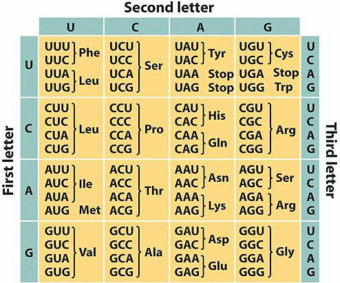

# Elementi koji čine biohemijsku mašineriju za sintezu proteina: ribozomi i RNK

Translacija je prevođenje informacija redosleda nukleotida iRNK u sekvencu aminokiselina odgovarajućeg proteina.
Glavne komponente translacionog sistema su ribozomi, tRNK, aminoacil-tRNK sintetaza i faktori inicijacije, elongacije i terminacije.

## Ribozomi

Sinteza proteina se odvija u ribozomima. Ribozomi eukariota su 80S ribozomi, sastavljeni od velike 60S i male 40S subjedinice.
U sastav velike subjedinice ulaze 28S, 5.8S i 5S rRNK i oko 40 proteina, dok u sastav male subjedinice ulazi 18S rRNK i oko 30 proteina.
Ribozomi su prisutni u citoplazmi, mitohondrijama i na površini GER-a.

Sklapanje ribozoma se odvija u nukleolusu, pakovanjem rRNK sa ribozomalnim proteinimna.
Nukleolus je mesto koje sadrži nukleolarne organizatorske regione (NOR), odnosno DNK petlje različitih hromozoma koje nose gene za rRNK.
Nakon transkripcije rRNK, dolazi do oblaganja 5' kraja 45S rRNK sa proteinima, pridružuje se 5S rRNK, a zatim uz pomoć RNK-vezujućih proteina i ribonukleoproteina (kao U3 snRNP)
dolazi do isecanja rRNK i proteina i formiranja prekursora velike i male subjedinice.

## Kodon i antikodon

Kodon je sekvenca od tri nukleotida koja određuje aminokiselinu, početak ili kraj sinteze polipeptidnog lanca. Komplementaran triplet na tRNK se naziva antikodon.

Za većinu aminokiselina postoji dva ili više kodona (20 aminokiselina, a 64 kodona). Samo metionin i triptofan imaju po jedan,

Kodon AUG predstavlja START kodon, dok su kodoni UAA, UAG i UGA STOP kodoni, koji signaliziraju prekid sinteze polipeptidnog lanca. STOP kodoni ne kodiraju specifičnu aminokiselinu.

Antikodon je komplementaran kodonu, ali ta komplementarnost nije apsolutna. Da je komplementarnost apsolutna, trebalo bi da postoji 61 različita tRNK za 61 kodon koji kodira aminokiselinu, ali slučaj je da postoji oko 40 različitih tRNK.
Naime, po hipotezi nesigurnog sparivanja ili "wobble" hipotezi, dolazi do nespecifičnog sparivanja treće baze na 5' kraju antikodona.
Prve dve baze se sparuju normalno (kodone sa različite prve dve baze prepoznaju različite tRNK), dok sparivanje treće nije potpuno komplementarno.
Ako se G nađe na tom mestu, može se spariti sa U ili sa C. Osim toga, modifikacija G u inozin u antikodonu omogućava tRNK da prepozna različite kodone, jer se I sparuje sa C, U ili A.

[← Prethodno pitanje](proteini-koji-vezuju-kiseonik-hemoglobin-i-mioglobin.md)
[Sledeće pitanje →](aktivacija-aminokiselina-i-sklapanje-funkcionalnog-ribozoma.md)

[← Nazad na pitanja](index.md)
