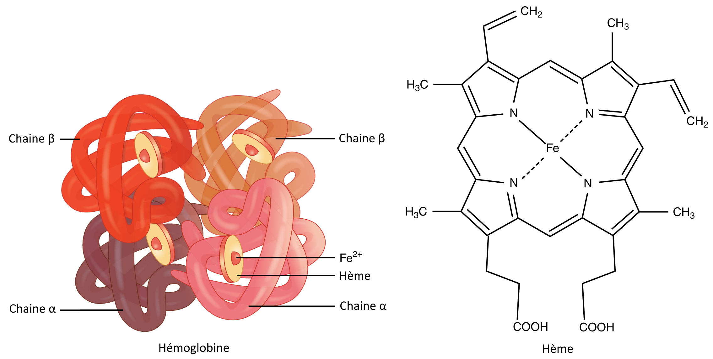
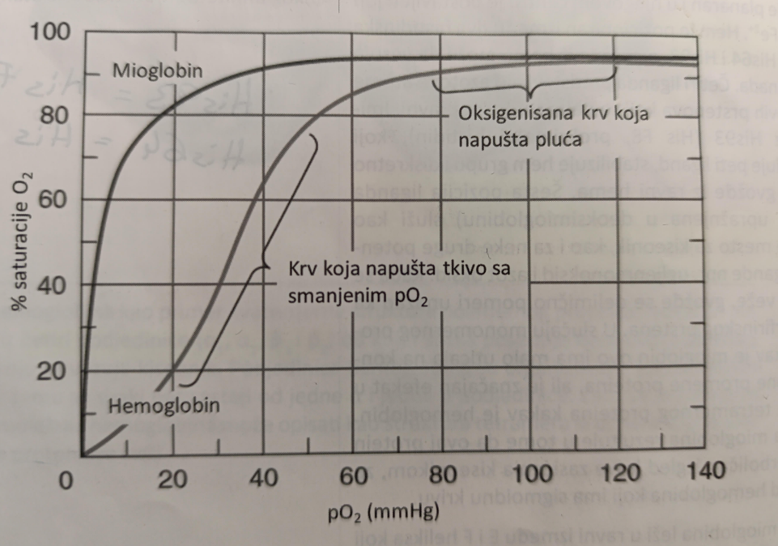

# Proteini koji vezuju kiseonik: hemoglobin i mioglobin

U metaloproteine koji sadrže hem spadaju hemoglobin, mioglobin i citohrom (ima i bakar).
Hem predstavlja ciklični tetrapirolov prsten koji se sastoji od četiri pirola međusobno povezanih metilenskim mostovima. Prsten je planaran i u centru sadrži Fe2+.

## Hemoglobin

U hemoglobinu hem je pozicioniran između dva histidinska ostatka, His64 (E7, distalni) i His93 (F8, proksimalni). Gvožđe se vezuje za azote pirola. Peti ligand je His93 koji stabilizuje hem i izmešta gvožđe iz ravni prstena za 0,03nm.
Šesto vezno mesto služi za vezivanje kiseonika (ili ugljenmonoksida). Vezivanje kiseonika pomera gvožđe ka ravni prstena, što vuče i histidin, a time i čitav globinski lanac.
To uzrokuje pucanje sonih mostova između subjedinica i dovodi do konformacionih promena čitavog molekula hemoglobina. Posledica toga je povećanje afiniteta ka kiseoniku (prelazi iz T-tense u R-relaxed stanje).

## Mioglobin

Mioglobin je monomerni protein koji se sastoji od 153 aminokiseline. U njegovoj strukturi nailazimo na osam α-heliksa koji formiraju hidrofobni džep u kojem je smešten hem kao prostetična grupa. Nema β-ploča u strukturi.

## Kriva saturacije

[← Prethodno pitanje](struktura-proteina-nivoi-organizacije-molekula.md)
[Sledeće pitanje →](elementi-koji-cine-biohemijsku-masineriju-za-sintezu-proteina-ribozomi-i-rnk.md)

[← Nazad na pitanja](index.md)
