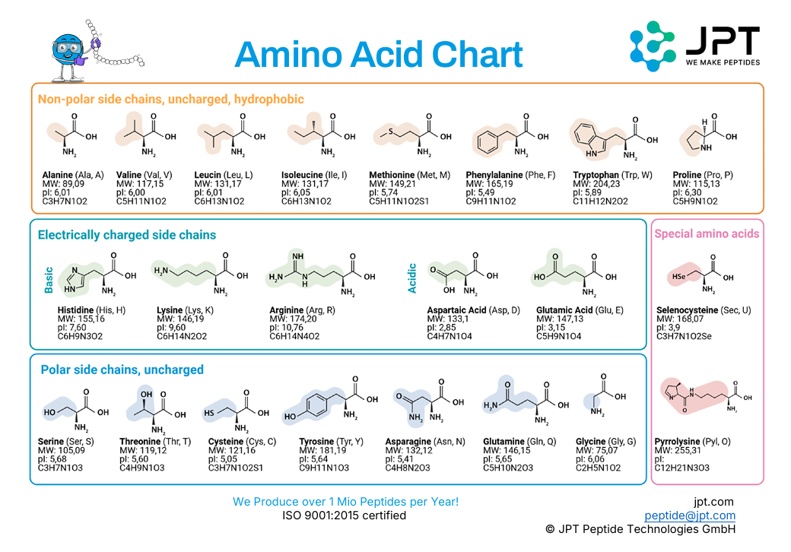
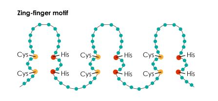

# Struktura proteina – nivoi organizacije molekula

Humani proteini su linearni nerazgranati molekuli koji se sastoje od 20 osnovnih aminokiselina i od izvedenih aminokiselina, nastalih posttranslacionom modifikacijom osnovnih.

## Aminokiseline

Aminokiseline su amfoterni molekuli (imaju i kisele i bazne grupe). Pojedine aminokiseline imaju dodatne karboksilne ili amino grupe u R-ostatku što im daje kiseo, odnosno bazan karakter.
Sve aminokiseline su L-stereoizomeri.

Možemo ih podeliti u četiri grupe:

	1) Nepolarne (hidrofobne) aminokiseline: Ala, Val, Leu, Ile, Met, Pro, Phe, Trp;
	
	2) Kisele (negativno naelektrisane): Asp, Glu;
	
	3) Polarne (hidrofilne): Asn, Gln, Gly, Ser, Thr, Tyr, Cys;
	
	4) Bazne (pozitivno naelektrisane): Lys, Arg, His;

Na osnovu toga da li ih možemo sintetisati ili ih moramo unositi hranom, delimo ih na:

	1) esencijalne - moramo ih unositi (His, Leu, Ile, Lys, Met, Phe, Phr, Trp, Val);
	
	2) neesencijalne - možemo ih sintetisati;

## Proteini

Peptidna veza nastaje između α-karboksilne grupe jedne i α-amino grupe druge aminokiseline. Prikazujemo je kao C-N-C-C.
Veza je parcijalno dvostruka, rigidna (sprečena rotacija N-C) i planarna, zauzima trans konfiguraciju usled sternih interakcija bočnih grupa i nenaelektrisana je, ali polarna.
Struktura peptida se piše sa leva na desno, N → C. U zavisnosti od sadržaja aminokiselina, peptid može biti kiseo ili bazan.

### Nivoi organizacije

Svi proteini imaju primarnu, sekundarnu i tercijarcnu strukturu, a polimerni proteini imaju i kvaternarnu.

#### Primarna struktura

Predstavlja redosled aminokiselina polipeptidnog lanca sa položajem svih kovalentnih modifikacija. Redosled aminokiselina je kodiran od strane DNK.

#### Sekundarna struktura

Stabilizovana je vodoničnim vezama. Razlikujemo sledeće strukture:

 - α-heliks: podrazumeva uvrtanje polipeptidnog lanca usled stvaranja vodoničnih veza između svake četvrte aminokiseline istog lanca

 - β-nabrana ploča: vodonična veza se stvara između udaljenih aminokiselina istog ili susednog lanca. Razlikujemo β-ploče sa paralelno i antiparalelno postavljenim lancima ili delovima lanca.

Određene aminokiseline mogu remetiti stvaranje sekundarnih struktura. Na primer, glutamat ili lizin i arginin ometaju stvaranje vodoničnih veza usled odbijanja naelektrisanih bočnih grupa.
Prolim nema slobodan vodonik, pa isto remeti stvaranje veze.

Specifično uređeni delovi sekundarne strukture koji se pojavljuju u više različitih proteina predstavljaju strukturne motive, koji mogu imati određenu funkciju.
Primer je motiv cinkovog prsta, koga nalazimo u regulatornim proteinima koji se vezuju za DNK.
Sadrže Zn povezan sa četiri Cys ili dva Cys i dva His koji su međusobno povezani lancem od dvanaest aminokiselina.

#### Tercijarna struktura

Nastaje daljim savijanjem polipeptidnog lanca. U stabilizaciji strukture učestvuju hidrofobne interakcije, jonske veze, vodonične veze i disulfidni mostovi.

Prilikom stvaranja tercijarne strukture, polipeptidni lanci se umotavaju u čvrste, relativno nezavisne strukture ili domene, koje imaju karakterističan sferan oblik.
Domeni imaju hidrofobno jezgro i polarnu spoljašnjost. Domeni su međusobno povezani neuređenim delovima lanca i pokazuju pokretljivost jedni u odnosu na druge, što ima izrazit funkcionalni značaj, na primer u enzimskoj katalizi.

#### Kvaternarna struktura

Predstavlja udruživanje više polipeptidnih jedinica - polimerni proteini. Mogu biti homopolimeri ili heteropolimeri. Strukturn ponovak u polimernom proteinu nazivamo protomera.
U stabilizaciji učestvuju isključivo nekovalentne veze: vodonične veze, hidrofobne i elektrostatske interakcije i van der Valsove sile.

[Hemoglobin](proteini-koji-vezuju-kiseonik-hemoglobin-i-mioglobin.md## Hemoglobin) je prvi polimerni protein čija je struktura opisana.
Sastoji se od četiri subjedinice: α1, α2, β1 i β2. One su ograničene kao simetrični parovi jedne α i jedne β subjedinice.
Zato možemo reći da je hemoglobin tetramer ili dimer dve αβ protomere.   

[Sledeće pitanje →](proteini-koji-vezuju-kiseonik-hemoglobin-i-mioglobin.md)

[← Nazad na pitanja](index.md)
