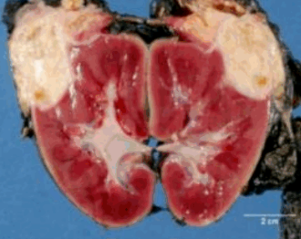
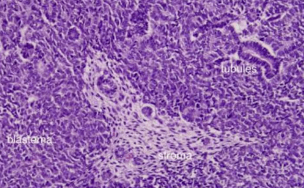

# Tumori bubrega dečjeg doba

Najčešći tumor bubrega dečjeg doba je nefroblastom - Vilmsov tumor, koji se obično javlja između druge i pete godine života. 

Velika, solitarna, jasno ograničena masa. Na preseku meke, homogene građe, sivkasto-smeđe građe boje, sa fokusima krvarenja, nekroze i cistične degeneracije.

Mikroskopski je karakteristična sličnost sa fazama nefrogeneze. Sastoji se od tri komponente, koje ne moraju biti uvek zastupljeme, a i njihov međusobni odnos je varijabilan.
Te komponente su:

 - Blastemska - plaže malih, "plavih", nediferenciranih ćelija. 
 - Epitelna - abortivni tubuli i glomeruli. 
 - Stromalna - fibroblastne ili miksoidne morfologije. 
 

Oko 5% tumora sadrži polja anaplazije, sa krupnim, hiperhromatičnim ćelijama sa pleomorfnim jedrima.
Anaplazija je povezana sa stečenom mutacijom TP53 i pojavom rezistencije na hemioterapiju, tako da je distribucija anaplazije
izrazito važna za prognozu.

Nefrogeni ostaci se smatraju prekursorskom lezijom, a njihovo prisustvo u resekcionom materijalu tkiva bubrega je povezano
sa povećanim rizikom od nastanka nefroblastoma u kontralateralnom bubregu.

Klinički se manifestuje kao palpabilna masa u abdomenu, retko sa groznicom, intestinalnom opstrukcijom
zbog kompresije creva i hematurijom. Prognoza je odlična uz hemioterapju i nefroktomiju.

Određena sindromska oboljenja su povezana sa povećanim rizikom za nastanak nefroblastoma:

 1) Denis-Drašov sindrom - disgenezija gonada i nefropatija. 
  
 2) Bekvit-Videmanov sindrom - uvećani organi i delovi tela. 
 
 3) WAGR sindrom - Vilmsov tumor, aniridija (potpuno ili delimično odsustvo irisa), anomalije genitalnog sistema i mentalna retardacija. 

[← Prethodno pitanje](tumori-bubrega-odraslog-doba.md)
[Sledeće pitanje →](tumori-donjih-mokracnih-puteva.md)

[← Nazad na pitanja](index.md)
