# Tumori bubrega odraslog doba

Možemo ih podeliti na primarne i sekundarne, a primarne dalje na beningne i maligne.

## Beningni tumori

1) Onkocitom
 
 - Nastaje iz interkalatnih ćelija sabirnih kanalića.
 - Povezan je sa genetičkim promenama u vidu gubitka hromozoma 1 i Y.
 - Karaketristika su brojne mitohondrije što objašnjava njegovu smeđu boju i sitnozrnastu eozinofilnu citoplazmu.
 - Centralni zvezdoliki ožiljak.
 - Imidžing metodama se ne razlikuje jasno od ostalih tumora pa se pristupa nefrektomiji.
 
 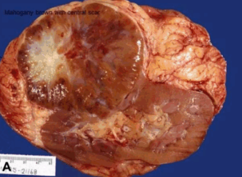
 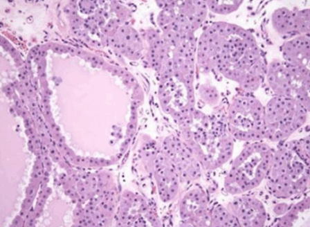
 
2) Papilarni adenom

 - Čest akcidentalan nalaz na obdukcijama (40% opšte populacije).
 - Manji od 15 mm, nemaju veći klinički značaj.
 
 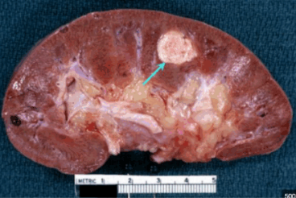
 
3) Angiomiolipom

 - Sastoji se od krvnih sudova, mišićnog i masnog tkiva.
 
## Maligni tumori

Karcinom bubrežnih ćelija (Renal cell carcinoma - RCC):

 - Nastaje od epitela bubrežnih tubula pa je dominantno lokalizovan u korteksu.
 - Predstavlja 80% svih malignih tumora bubrega, a 3% svih karcinoma.
 - Obično se javlja u šestoj i sedmoj deceniji života, dva puta češći kod muškaraca.
 - Povećan rizik kod pušača, gojaznih, hipertenzivnih, hronično izloženih kadmijumu, kao i kod osoba sa stečenom policističnom bolesti bubrega
 nastalom usled dugotrajne dijalize.
 - Morfološki podtipovi su: svetloćelijski (75%), papilarni (16%) i hromofobni (7%).

1) Karcinom svetlih ćelija - ccRCC

  - Uglavnom sporadični, ali se familijarno javljaju u sklopu Fon Hipel-Lindauvog sindroma (Autozomalno-dominantna bolest, koju
  karakteriše predispozicija za brojne neoplazme, posebno hemangioblastom malog mozga i retine).
  - Histološki izgrađeni od ćelija svetle citoplazme.
  - Solitarne, sferične mase u koretksu, žutonarandžaste boje sa fokusima nekroze i krvarenja.
  - Jasno je ograničen, ali kod agresivnijih formi može doći do pojave jezičaka tumorskog tkiva koji se prožimaju u lokalni parenhim.
  - Može infiltrirati tubule bubrega, a češće i renalnu venu, gde se može proširiti i do desnog srca.
  - U zavisnosti od količine lipida i glikogena, citoplazma može biti solidna ili biti potpuno vakuolisana.
  - Oskudna, ali dobro vaskularizovana stroma.
  - Biomarkeri za citokeratin i vimentin.
  
 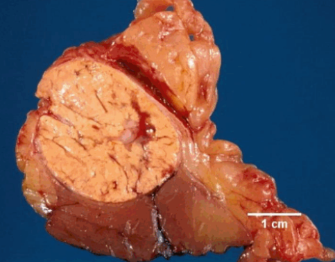
 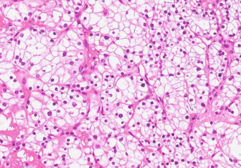
  
2) Papilarni karcinom -pRCC
 
  - Često multifokalni i bilateralni.
  - Javljaju se i sporadično i familijarno.
  - Na poprečnom preseku žućkaste boje, ali zbog manje masti u odnosu na ccRCC, boja je manje upadljiva.
  
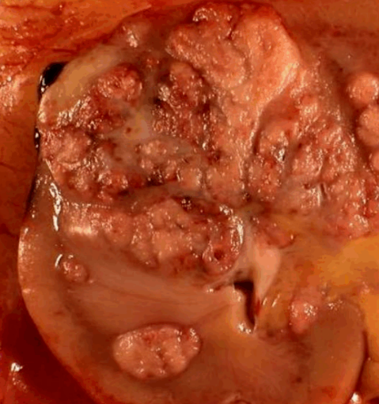
  
  - Razlikujemo dva podtipa:
  
   1) Tip 1 - Izgrađen od ćelija kuboidnog izgleda, oskudne bazofilne citoplazme, uniformnih jedara.
    Ćelije grade papile čija stroma sadrži veliki broj penušavih ćelija.
    
 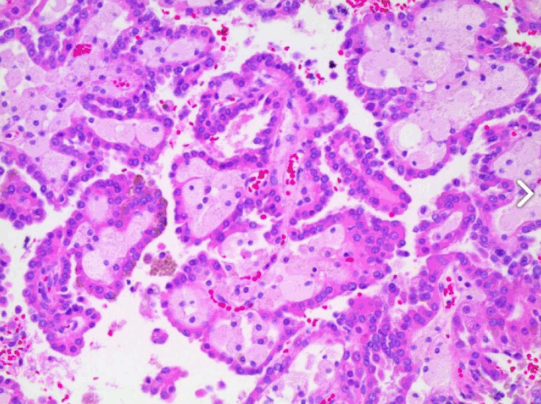
    
   2) Tip 2 - Papile su obložene pseudoslojevitim epitelom. Izgrađen od ćelija sa obilnijom citoplazmom i većeg nuklearnog gradusa.

 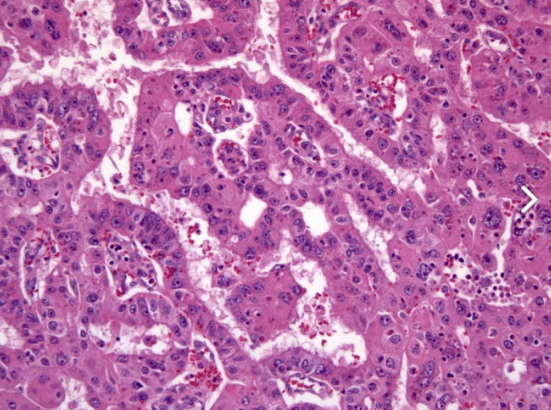
    
3) Hromofobni karcinom - cRCC

  - Ćelije tamnije boje od ostalih.
  - Višestruki gubici celih hromozoma.
  - Povoljna prognoza.
  - Makroskopski smeđe boje.
  - Ćelije imaju svetlu citoplazmu, centralno postavljeno jedro sa haloima svetle citoplazme i naglašene membrane.
 
 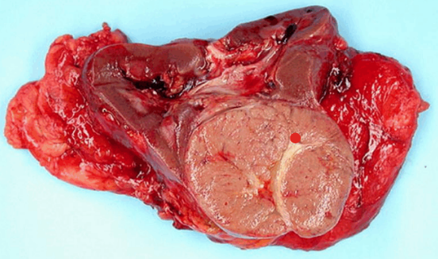
 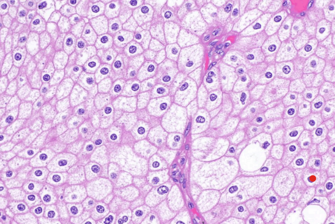
 
Najčešća manifestacija RCC je hematurija. Najčešće metastazira u pluća i kosti.
Klasični trijas: bezbolna hematurija, palpabilna masa u abdomenu i bol u slabinama.

Karcinom pijelona 

  - Tranziciocelularni tumor urotela.
  - Može dovesti do opstrukcije i hidronefroze.

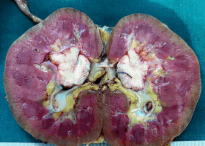

[← Prethodno pitanje](maligni-tumori-dojke.md)
[Sledeće pitanje →](tumori-bubrega-decjeg-doba.md)

[← Nazad na pitanja](index.md)
