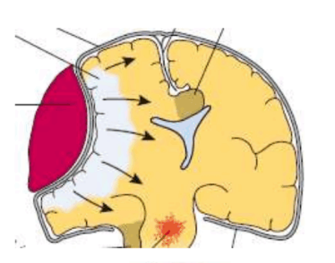
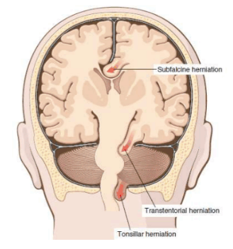
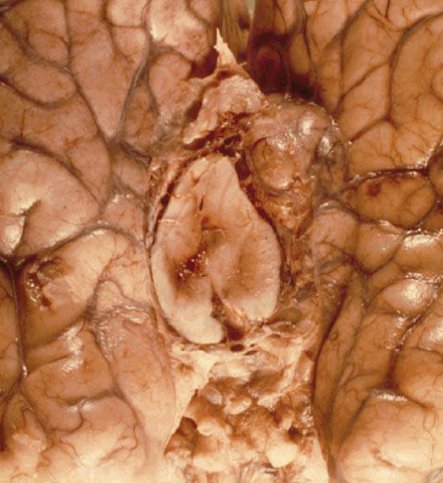
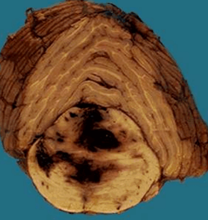
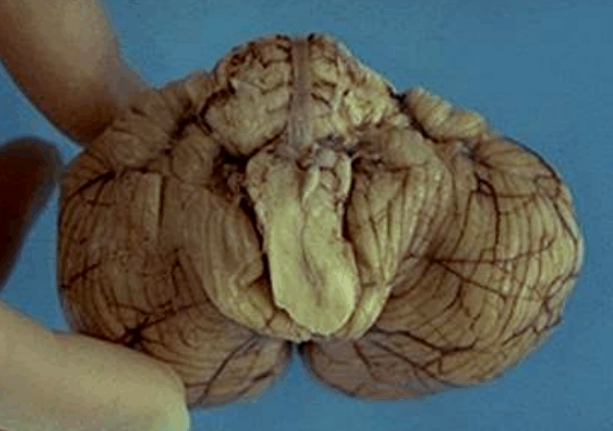
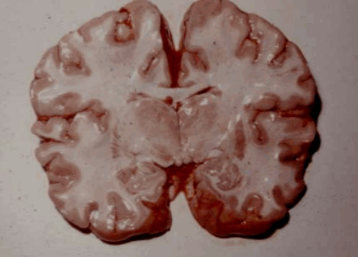
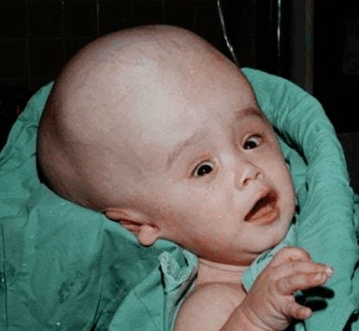

# Patologija povišenog intrakranijalnog pritiska, edem mozga i hidrocefalus

Povišen intrakranijalni pritisak nastaje usled povećanja volumena moždanog parenhima koji prevazilazi kapacitet lobanje.
Nastaje zbog edema, krvarenja, tumora, infarkta (zbog edema).

Načini na koji se mozak oštećuje:

	- Hernijacija - pomeranje mozga između prostora ograničenih duplikaturama.
	- Edem - nakupljanje tečnosti u parenhimu mozga.
	- Hidrocefalus - opstrukcija u protoku likvora i povećanje pritiska u komorskom sistemu.
	
## Hernijacija

 - Subfalksna - kompresija a. cerebri anterior
 
 
 
 - Transtentorijalna - kompresija III kranijalnog živca (dilatacija zenice), kompresija a. cerebri posterior (ishemija primarne vidne kore),
 kompresija kontralateralnog pedunkula (ipsilateralna hemiplegija), Direove hemoragije mezencefalona
 
 
 
 
 
 - Tonzilarna - kompresija moždanog stabla
 
  
	
## Edem mozga

Teorijska podela (u praksi nastaju udruženo ali je bitno zbog terapije):
  1) vazogeni - oštećenje zidova krvnih sudova (zapaljenje)
  2) citotoksični - oštećenja pumpi (virusna infekcija)
  3) intersticijalni - zbog povećanja pritiska u lumenu komora likvor iz komora prodire u parenhim jer ependimne ćelije nemaju bazalnu membranu
  

## Hidrocefalus

Dolazi do dilatacije komora. Kod dece mlađe od godinu dana ne dolazi do povećanja pritiska zbog toga što lobanja nije potpuno srasla, pa će doći do povećanja obima glave.

 - Komunikativni (neopstruktivni) - prepreka je u subarahnoidnom prostoru što dovodi do povećanja čitavog ventrikularnog sistema.
 
 - Nekomunikativni (opstruktivni) - prepreka je u komornom sistemu što dovodi do povećanja dela ventrikularnog sistema iznad opstrukcije.
 
 - Hydrocephalus ex vacuo - nastaje kao posledica atrofije moždanog parenhima, u sklopu senilne atrofije
 
Hidrocefalus može biti kongenitalni, najčešće zbog atrezije Silvijevog kanala. Često letalno.

Hidrocefalus se leči šantovima koji odvode višak likvora u desnu pretkomoru ili peritoneum.

[← Prethodno pitanje](patologija-celija-tkiva-cns.md)
[Sledeće pitanje →](urodjene-malformacije-cns.md)

[← Nazad na pitanja](index.md)
